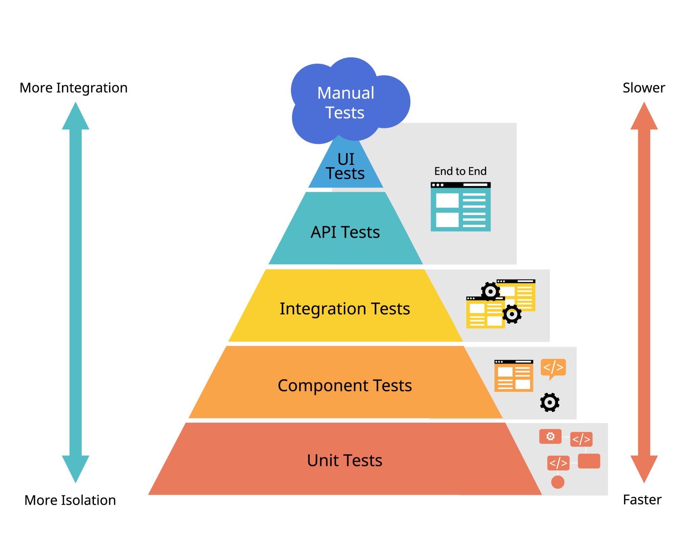

### 1. What is the difference between unit tests, integration tests, regression tests, and performance tests?
- **Unit tests:** Unit tests are meant to test the individual functionalities or modules of a system being developed. 
It can be a single function or a block of code. It is usually done by developers.
- **Integration tests:** Integration tests are written to test the interaction between the classes, functions, modules, database or API. 
It captures the errors like incorrect data formats, communication mismatches, etc. 
It ensures the integration is smooth and the modules are talking to each other properly. 
Stubs, drivers & mock classes or functions are used to test the interaction between the modules if the development of other module is not done. 
- **Regression Tests:** Regression tests are tests that needs to be repeated again and again after a change or fix happened in the system. 
This ensures that the new change did not break the old code or cause a new error or break in any functionality that already working properly.
- **Performance Tests:** Performance tests measures response times, throughput and resource limits. It measures the behavior of the system under specific workload.
It focuses on non-functional attributes like responsiveness, stability, scalability and resource utilization.
Performance tests helps improve the code efficiency, fine-tuning the code and optimize its performance.

### 2.Describe how you work with TDD.

- Test Driven development is a software development process that focuses on writing the tests first, before the code is written. Instead of writing the code and testing to see if it works, TDD flips the cycle. 
- TDD defines the test for the functionality to be developed and the code is built to meet the that requirements.
- TDD uses _Red-Green-Refactor cycle_. 
  - Red: Writing a small piece of code for the tests and watch the tests fail.
  - Green: Writing enough code to pass the tests. Can hardcode the inputs and results.
  - Refactor: Now, enhancing the code, removing duplicates, handling positive, negative scenarios & edge cases and 
              optimizing the code.
- Benefits: _Reduced debugging, Better design, High Code quality and Increases confidence_.
  
### 3.Describe how BDD differs from TDD.
- TDD focuses on code and design implementation. We write the tests for the design we are going to implement.
- BDD focuses on the system's behavior, user experience and business requirements of the project.
- TDD is used only by developers to write tests using coding languages like python, java, etc. 
- BDD uses natural language syntax Gherkin: _Given, When, Then_. BDD involves Product owners, QA Testers and developers collaboratively.
- TDD is used in Unit, integration, regression and performance testing.
- BDD is used in Acceptance testing and End-to-End Testing.
- TDD tools used are pytest, unittest, Junit, ...
- BDD tools are Behave, Cucumber, ...

### 4. Imagine that you were going to make a website similar to Läslistan, both frontend and backend. If you had to choose unconditionally, what kinds of tests would you want to use? Justify your choice.
- If I were to build a platform like Läslistan, 
I would combine TDD (Test-Driven Development) for the internal code quality and 
BDD (Behavior-Driven Development) to ensure the application meets business and user requirements.
- I would implement these methodologies across a classic Testing Pyramid:

  - 70% Unit Tests: To cover every edge case of string formatting, math calculations, and data validation.

  - 20% Integration Tests: To secure the critical API paths and database state transitions.

  - 10% E2E Tests: Reserved strictly for core user journeys (e.g., creating an account, adding a book, toggling a favorite, verifying stats).
- All of these tests would be automated to run as Regression Tests in a CI/CD pipeline.

#### Why this specific breakdown?
If too many E2E tests are built, the test suite becomes incredibly slow, expensive to run in CI/CD pipelines, 
and "flaky" (failing because of slow network timing rather than actual bugs). By using unit tests for the heavy 
lifting and E2E tests for the critical paths, we get an automated pipeline that runs quickly, identifies bugs instantly, 
and guarantees a seamless experience for users.
